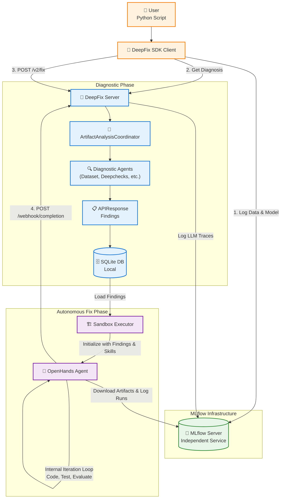
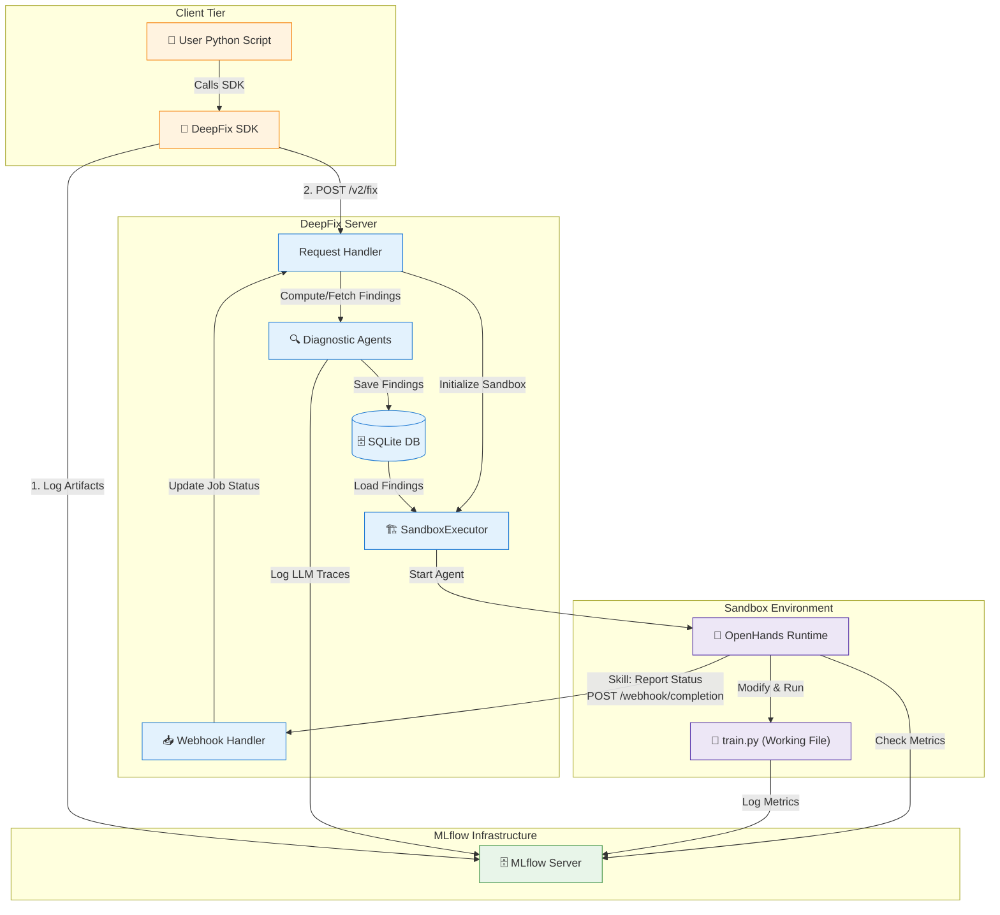

# Autonomous Fix System Architecture

This document describes the autonomous fix system that extends DeepFix to not just diagnose ML issues, but autonomously apply fixes. We embrace a **lean architecture** where the DeepFix Server delegates the complexity of iteration and code generation entirely to an **OpenHands autonomous agent**.

## System Overview

The autonomous fix system enhances DeepFix's diagnostic capabilities with a streamlined, agent-centric execution loop. It relies on **OpenHands** as the primary driver for generating and evaluating fixes, while using **MLflow** as an independent service for artifact and metrics management.

### Key Architecture Principles

- **Independent MLflow**: MLflow runs as a separate service (local or remote) accessible via REST API. Model and dataset artifacts are logged here before fixing begins.
- **Agent Autonomy**: Instead of the DeepFix Server meticulously managing iteration loops and generating code patches, it delegates the diagnosis findings and a clear system prompt to OpenHands. OpenHands acts as an autonomous engineer.
- **Sandboxed Execution**: OpenHands works in isolated temporary directories with no side effects on the original project.
- **Skill-Based Communication**: OpenHands uses provided skills to interact with the environment, evaluate metrics, and finally report its completion status back to the DeepFix Server via a POST webhook.

---

## System Component Diagram



---

## Detailed Component Connections



---

## Data Flow: From Diagnosis to Autonomous Fixes

The data flow is drastically simplified to leverage the strengths of OpenHands. Instead of DeepFix micro-managing the loop, we provide context and get out of the way.

### Phase 1: Artifact Logging & Diagnosis
```text
User Input (Dataset, Model, Training Logs)
    ↓
[SDK.ingest()]
    ↓
Logs dataset and model artifacts to MLflow Tracking Server.
    ↓
[SDK.diagnose()] (Optional pre-step)
    ↓
Diagnostic Agents analyze artifacts and synthesize findings (APIResponse).
    ↓
DeepFix Server logs LLM reasoning traces to MLflow.
    ↓
Findings are persisted in a local SQLite database.
```

### Phase 2: Triggering the Fix
```text
[SDK.diagnose_and_fix()]
    ↓
SDK sends POST /v2/fix (includes MLflow paths & prior findings)
    ↓
DeepFix Server receives request.
    ↓
Server retrieves persisted diagnosis findings from SQLite database.
    ↓
Server initializes a Sandbox environment and prepares OpenHands configuration.
```

### Phase 3: Autonomous Agent Execution (OpenHands)
```text
SandboxExecutor boots OpenHands Runtime
    ↓
System Prompt provided to OpenHands:
  - "Here are the diagnostic findings..."
  - "Here is the baseline metric..."
  - "Your goal is to improve the model by fixing these issues."
  - "You have access to MLflow to download the data and log new runs."
    ↓
OpenHands (Autonomously):
  1. Downloads data from MLflow.
  2. Creates or modifies `train.py` to inject fixes (e.g., handles class imbalance).
  3. Executes `train.py`.
  4. Queries MLflow to check the new run's metrics.
  5. Iterates until the metrics plateau, hit the target, or the agent runs out of ideas.
```

### Phase 4: Webhook Completion & Status Update
```text
OpenHands completes its iteration loop.
    ↓
Agent uses provided "DeepFix Communication Skill" (e.g., a CLI tool or Python script injected in the environment).
    ↓
Agent sends POST request to DeepFix Server's webhook endpoint with:
  - Final run ID
  - List of applied fixes
  - Success/Failure status
    ↓
Server updates internal job status.
    ↓
User polls or receives completion payload via the SDK.
```

---

## OpenHands Skills & Environment

To enable this lean architecture, we provide specific tools ("skills") to the OpenHands agent within its sandbox. 

1. **MLflow Data Access Skill**: Utilities to easily pull the correct `DatasetDict` from the MLflow artifact store without boilerplate.
2. **DeepFix Communication Skill**: A script or command (e.g., `report_completion`) that the agent is instructed to run when it decides it has finished iterating. This skill encapsulates the logic for making the POST request back to the DeepFix Server, abstracting away network complexities from the agent.
