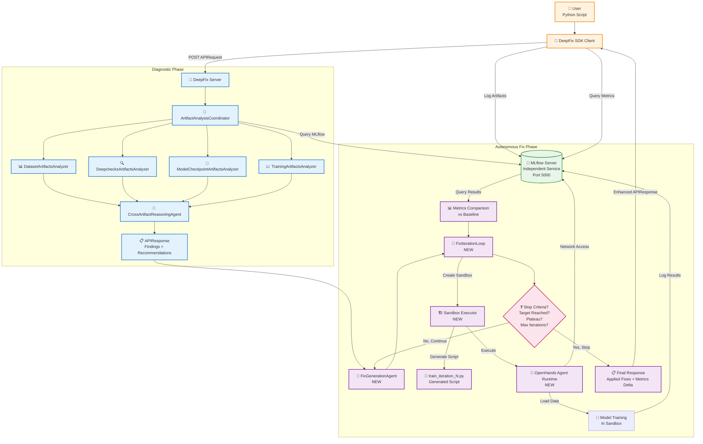

# Autonomous Fix System Architecture

This document describes the autonomous fix system that extends DeepFix to not just diagnose ML issues, but autonomously apply fixes and iterate until optimal results are achieved.

## System Overview

The autonomous fix system enhances DeepFix's diagnostic capabilities with an automated fix generation and execution loop. It integrates with **OpenHands** as the agent runtime and uses **MLflow** as an independent service for artifact and metrics management.

### Key Architecture Principles

- **Independent MLflow**: MLflow runs as a separate service (local or remote) accessible via REST API
- **Sandboxed Execution**: OpenHands executes fixes in isolated temporary directories with no side effects on the original project
- **Template-Based Training**: Dynamic generation of training scripts with injected fixes
- **Iterative Improvement**: Automated loop that applies fixes, measures improvement, and stops when criteria are met

---

## System Component Diagram



---

## Detailed Component Connections

```mermaid
flowchart LR
    subgraph "Client Tier"
        User["👤 User Python Script"]
        SDK["📡 DeepFix SDK"]
    end

    subgraph "MLflow Infrastructure"
        MLflowServer["🗄️ MLflow Server<br/>(Independent)<br/>http://localhost:5000"]
        ArtifactStore["📦 Artifact Store<br/>(Metrics, Models, Data)"]
        MetricsDB["📊 Metrics DB"]
    end

    subgraph "DeepFix Server"
        Handler["Request Handler"]
        DiagnosticAgents["🔍 Diagnostic Agents<br/>(Parallel)"]
        CrossArtifact["🔗 CrossArtifactReasoningAgent"]
    end

    subgraph "Autonomous Fix System"
        FixGen["🧠 FixGenerationAgent"]
        FixLoop["🔄 FixIterationLoop"]
        SandboxExec["🏗️ SandboxExecutor"]

        subgraph "Sandbox Isolation"
            TrainingScript["📝 train_iteration_N.py<br/>(Generated)"]
            ModelTraining["🏃 Model Training"]
            OpenHandsRuntime["🤖 OpenHands Runtime"]
        end

        MetricsCompare["📊 Compare Metrics<br/>vs Baseline"]
    end

    %% Client to Server
    User -->|Calls SDK| SDK
    SDK -->|POST APIRequest| Handler

    %% Server to MLflow
    Handler -->|Query Artifacts| MLflowServer
    DiagnosticAgents -->|Query Metrics| MLflowServer
    CrossArtifact -->|Output| Handler

    %% Diagnostic to Fix System
    Handler -->|Findings| FixGen
    FixGen -->|Proposed Fixes| FixLoop
    FixLoop -->|Execute Iteration| SandboxExec

    %% Sandbox Execution
    SandboxExec -->|Generate| TrainingScript
    SandboxExec -->|Execute| OpenHandsRuntime
    TrainingScript -->|Run| ModelTraining
    ModelTraining -->|Log Metrics| MLflowServer

    %% Metrics Feedback Loop
    MLflowServer -->|Query New Run| MetricsCompare
    MetricsCompare -->|Improve? Stop?| FixLoop

    %% SDK to MLflow (Initial Ingest)
    SDK -->|Log Artifacts<br/>client.ingest()| MLflowServer

    %% MLflow Internal
    MLflowServer --> ArtifactStore
    MLflowServer --> MetricsDB

    %% Response Back
    Handler -->|APIResponse| SDK
    SDK -->|Results| User

    classDef client fill:#fff3e0,stroke:#f57c00
    classDef server fill:#e3f2fd,stroke:#1976d2
    classDef mlflow fill:#e8f5e9,stroke:#388e3c
    classDef newcomp fill:#f3e5f5,stroke:#7b1fa2
    classDef sandbox fill:#ede7f6,stroke:#512da8

    class User,SDK client
    class Handler,DiagnosticAgents,CrossArtifact server
    class MLflowServer,ArtifactStore,MetricsDB mlflow
    class FixGen,FixLoop,SandboxExec,MetricsCompare newcomp
    class TrainingScript,ModelTraining,OpenHandsRuntime sandbox
```

---

## Data Flow: From Diagnosis to Autonomous Fixes

### Phase 1: Initial Diagnosis
```
User Input (Dataset, Model, Training Logs)
    ↓
[SDK.ingest()] → Log artifacts to MLflow
    ↓
[SDK.get_diagnosis_with_autonomous_fixes()]
    ↓
Server receives APIRequest
    ↓
Diagnostic Agents analyze artifacts (parallel)
    ↓
CrossArtifactReasoningAgent synthesizes findings
    ↓
APIResponse with findings → Continue to Phase 2
```

### Phase 2: Fix Generation
```
APIResponse (Findings)
    ↓
FixGenerationAgent interprets findings
    ↓
Maps to concrete fixes:
  - Hyperparameter changes (max_depth, learning_rate)
  - Data preprocessing (imputation, scaling)
  - Class imbalance handling (class_weight, stratification)
  - Feature engineering (selection, transformation)
    ↓
Returns list of Fix objects (ordered by priority)
```

### Phase 3: Sandbox Execution & Iteration
```
For each Fix in fixes_list:
    ↓
    [FixIterationLoop.run_iteration(fix)]
        ↓
        [SandboxExecutor.create_sandbox()]
            ↓
            Create temp directory
            Copy user's training code template
                ↓
        [SandboxExecutor.apply_fix(fix)]
            ↓
            Inject fix into train_iteration_N.py:
              - Load data from MLflow API
              - Apply hyperparameter fix
              - Apply preprocessing fix
              - Train model
              - Log metrics to MLflow (new run)
                ↓
        [OpenHands.execute(train_iteration_N.py)]
            ↓
            python train_iteration_N.py
            (Network calls to MLflow for data/logging)
                ↓
        [MetricsComparison]
            ↓
            Query MLflow for new run ID
            Compare accuracy: baseline (0.82) → iteration_1 (0.85)
            Calculate delta: +3%
                ↓
    Check stop criteria:
      ✓ Target reached? (e.g., accuracy > 92%)
      ✓ Improvement plateau? (< 1% in last 2 iterations)
      ✓ Max iterations reached? (e.g., 5)
      ✓ No new findings? (agent has nothing else)
            ↓
        If STOP: → Phase 4
        If CONTINUE: Next iteration with updated findings
```

### Phase 4: Final Report
```
FinalResult aggregates:
  - Applied fixes [fix1, fix2, fix3]
  - Metric deltas [+3%, +2%, plateau]
  - Best iteration state
  - Timeline and resource usage
    ↓
Return to SDK as enhanced APIResponse
    ↓
User receives complete diagnostics + fixes applied + improvements
```

---

## MLflow Integration (Independent Service)

### MLflow Deployment
```
MLflow runs independently from DeepFix:

┌──────────────────────────────────────┐
│  MLflow Server (e.g., port 5000)     │
│                                      │
│  ├─ Tracking Server                  │
│  │  └─ Manages runs, metrics, params │
│  │                                  │
│  ├─ Artifact Store                   │
│  │  └─ S3, local filesystem, etc.    │
│  │                                  │
│  ├─ REST API                         │
│  │  ├─ /api/2.0/mlflow/runs/...     │
│  │  ├─ /api/2.0/mlflow/metrics/...  │
│  │  └─ /api/2.0/mlflow/artifacts/...|
│  │                                  │
│  └─ Metadata DB (SQLite/PostgreSQL) │
└──────────────────────────────────────┘

All components access via:
  mlflow.set_tracking_uri("http://localhost:5000")
  or environment variable MLFLOW_TRACKING_URI
```

### Data Access Pattern
```
Baseline Run (from user):
  run_id = "abc123"
  mlflow.log_metric("accuracy", 0.82)
  mlflow.log_artifact("train_data.csv")

Sandbox Iteration 1:
  # Load baseline data from MLflow
  client = mlflow.tracking.MlflowClient(tracking_uri=uri)
  artifacts = client.download_artifacts(run_id="abc123", path="")

  # Apply fixes and train
  ...

  # Log to new run
  with mlflow.start_run():
      mlflow.log_metric("accuracy", 0.85)

Server Post-Execution:
  # Query new run metrics
  runs = client.search_runs(experiment_ids=["0"])
  latest_accuracy = runs[0].data.metrics["accuracy"]
  improvement = latest_accuracy - 0.82  # 0.03 = +3%
```

---

## Sandbox Isolation & Safety

### Sandbox Architecture
```
Original Project Directory (UNTOUCHED)
├── src/
├── data/
├── train.py
└── requirements.txt

Sandbox Temporary Directory (ISOLATED)
├── mlruns/ → symlink or mount to MLflow data
├── train_iteration_1.py (GENERATED)
│   ├─ Load data from MLflow API
│   ├─ Apply fix #1
│   └─ Log results to MLflow
├── train_iteration_2.py (GENERATED for next iteration)
└── ...

After iteration completes:
  - Sandbox directory deleted
  - Original project unchanged
  - Only artifacts/metrics in MLflow
```

### Safety Guarantees
- ✅ **No side effects**: Original project files never modified
- ✅ **Isolated execution**: OpenHands runs in temp directory
- ✅ **Timeout protection**: Each iteration has max execution time
- ✅ **Atomicity**: Per-run MLflow logging ensures consistency
- ✅ **Rollback ready**: Can revert to any previous iteration

---

## Key Implementation Details

### Template Training Script
**Location**: `deepfix-kb/templates/train_template.py`

```python
# Injected variables by FixGenerationAgent
MLFLOW_TRACKING_URI = "http://localhost:5000"
BASELINE_RUN_ID = "abc123"
DATASET_NAME = "breast_cancer"
MODEL_CLASS = "HistGradientBoostingClassifier"

# Fixes (string-injected by agent)
# {FIXES_INJECTED_HERE}

import mlflow
import joblib
from sklearn.ensemble import HistGradientBoostingClassifier

mlflow.set_tracking_uri(MLFLOW_TRACKING_URI)

# Load baseline data from MLflow
client = mlflow.tracking.MlflowClient()
artifacts_dir = client.download_artifacts(
    run_id=BASELINE_RUN_ID,
    path="data"
)

# Apply fixes (injected)
# e.g., StandardScaler(), class_weight='balanced', etc.

# Train
model = HistGradientBoostingClassifier(...)
model.fit(X_train, y_train)

# Log new run
with mlflow.start_run():
    accuracy = model.score(X_test, y_test)
    mlflow.log_metric("accuracy", accuracy)
    mlflow.log_artifact("model.pkl")
```

### Fix Object Structure
```python
@dataclass
class Fix:
    fix_type: str  # "hyperparameter", "preprocessing", "feature_selection", etc.
    description: str  # "Increase max_depth from 3 to 5"
    code_patch: str  # Python code to inject into training script
    confidence: float  # 0-1 score
    expected_improvement: dict  # {"accuracy": 0.05}
```

### Stop Criteria
```python
def should_stop(iteration_history: List[Iteration]) -> bool:
    # Target metric reached
    if latest_accuracy >= TARGET_ACCURACY:
        return True

    # Improvement plateau
    if len(iteration_history) >= 3:
        recent_improvements = [
            iteration_history[-2].metrics["accuracy"] - iteration_history[-3].metrics["accuracy"],
            iteration_history[-1].metrics["accuracy"] - iteration_history[-2].metrics["accuracy"],
        ]
        if all(imp < 0.01 for imp in recent_improvements):
            return True

    # Max iterations
    if len(iteration_history) >= MAX_ITERATIONS:
        return True

    # Timeout
    if time.time() - start_time > MAX_EXECUTION_TIME:
        return True

    return False
```

---

## Deployment Considerations

### MLflow Service
```bash
# Start MLflow server independently
mlflow server \
  --backend-store-uri sqlite:///mlflow.db \
  --default-artifact-root ./mlruns \
  --host localhost \
  --port 5000
```

### DeepFix Configuration
```env
MLFLOW_TRACKING_URI=http://localhost:5000
OPENHANDS_ENABLED=true
OPENHANDS_DOCKER=false  # For local execution without Docker
MAX_FIX_ITERATIONS=5
FIX_EXECUTION_TIMEOUT=300  # seconds
TARGET_METRIC_NAME=accuracy
TARGET_METRIC_VALUE=0.90
```

---

## Related Documentation

- [Architecture Overview](/architecture/overview) — Core system design
- [Agent System](/architecture/agents) — Diagnostic agent framework
- [Client–Server Architecture](/architecture/client-server) — Communication patterns
